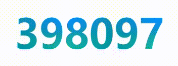

# vue-number-flip

This package makes it easy to transition between two numbers using a sliding animation.  
The new number being changed to does not need to have the same number of digits as the number being changed from.  
Currently only positive numbers can be displayed, due to the lack of a leading minus sign.

## Examples



## Installation

```bash
npm install vue-number-flip
```

## Basic usage

```vue
<template>
  <NumberFlip :value="num" />
</template>

<script>
import { ref } from 'vue'
import NumberFlip from 'vue-number-flip'

const num = ref(0)
</script>

<style>
@import 'vue-number-flip/style.css';
</style>
```

## Props

| Name              | Description                                                                            | Type       | Default                           |
| ----------------- | -------------------------------------------------------------------------------------- | ---------- | --------------------------------- |
| value             | The number which will be displayed when the NumberFlip instance is created.            | `number`   | `0`                               |
| decimalSeparator  | The decimal separator which should be used when decimal numbers are being displayed.   | `string`   | `.`                               |
| thousandSeparator | The thousand separator which should be used when thousand numbers are being displayed. | `string`   | `,`                               |
| formatter         | A function which can be used to format the number before it is being displayed.        | `function` | `(num: number) => num.toString()` |
| immediate         | Whether the initial number should be animated or not.                                  | `boolean`  | `true`                            |

## License

MIT

## Inspiration

This project is inspired by [number-flip-animation](https://github.com/der-Lehmann/number-flip-animation)
